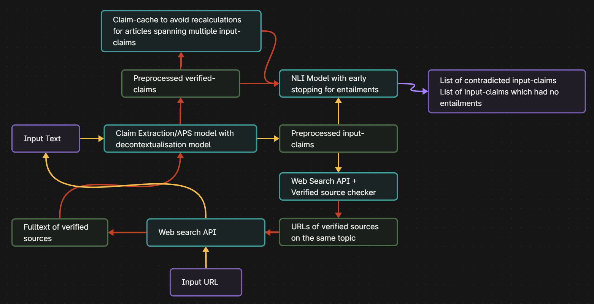

# AI-factcheck
Modular AI fact-checking implementation.
It uses static typing with enums, pydantic, and logging to reduce mistakes.
Class-local imports and cached embeddings for speed and efficiency.
Miscellaneous code is stuffed inside __init__s or utils.py to increase readability of `main.py` file.

Utility scripts, testing files, and research files that were used in the development of this project are in the `/scripts/` directory. The `tests.ipynb` file features more models that could have been used.
Main program can be found at `/src/`.

Pipeline for `old-main.py` in the `/scripts/` directory: (no chunking method, no dense retrieval or falsifiability checks)

Pipeline for `main.py`: to be made.

If you'd like to try out different models or algorithms, simplify modify the `config.py` file and the code will run. If you'd like to code your own models, you can do so in the `claim_extraction_models.py` or `other_models.py` file.

Pull requests are welcome.